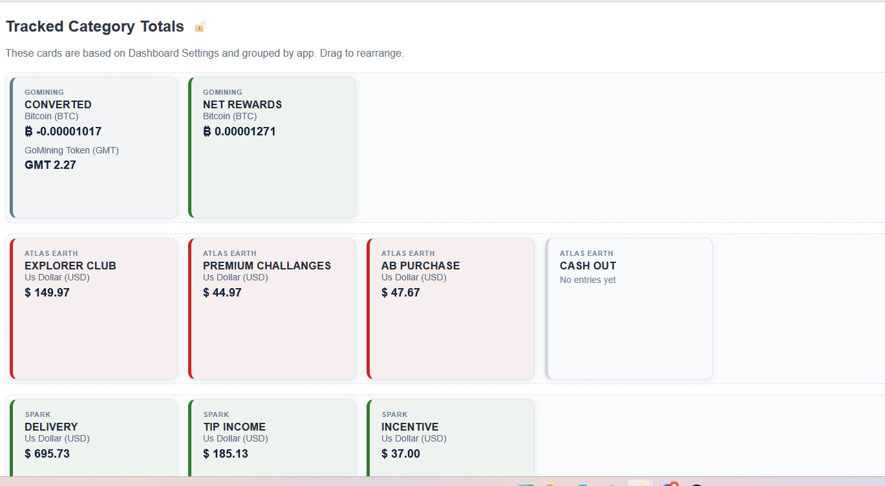
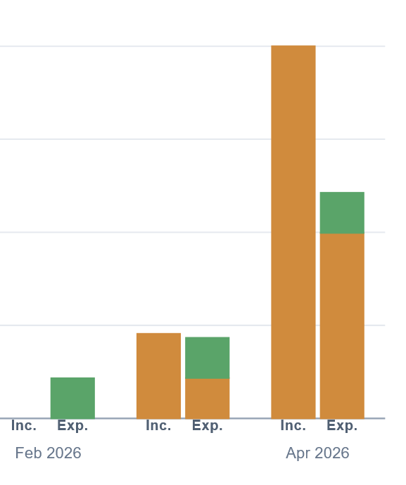
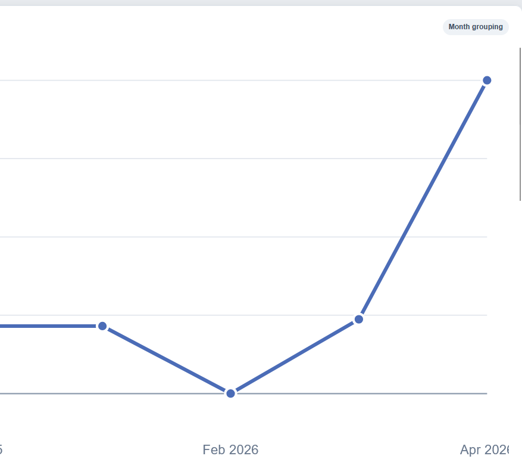
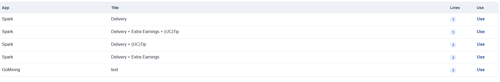
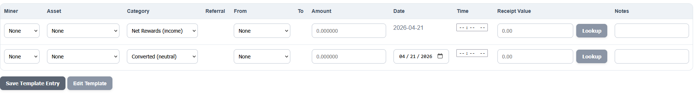
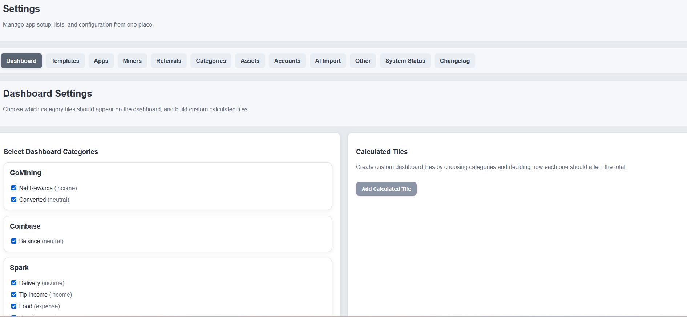

# Rewards Ledger

## Screenshots

### Ledger

### Dashboard

### Graphs

### More Graphs

### Templates Selection

### Templates Entry

A PHP/MySQL ledger-style tracker for GoMining activity.

## Requirements
- PHP 8+
- MySQL / MariaDB
- Local server (Laragon / UniServerZ recommended)

## Setup
1. Clone repo
2. Copy db.example.php to db.php and update credentials.
3. Update db.php with your credentials
4. Open in browser
5. Database auto-creates

## Known Limitations
- No user accounts yet
- No permissions system
- Quick Adds UI is basic (editing coming later)
- Dashboard still being refined

## Default Login
(None yet)

## Notes
- First load seeds default apps, assets, and categories

## Features

- Track miners individually
- Track gross and net mining rewards
- Track maintenance and electricity separately
- Track referral rewards and known/unknown referrals
- Track upgrades, withdrawals, transfers, and adjustments
- Quick Entry for one-off items
- Batch templates for repeated daily miner entry
- Batch totals by asset and behavior type

## Project Structure

- `public/` = web root
- `app/config/` = config
- `app/core/` = bootstrap, db, schema, helpers
- `app/components/` = header/footer
- `app/pages/` = page files
- `storage/` = uploads and storage

## Requirements

- PHP 8+
- MySQL / MariaDB
- Apache or Laragon

## Installation

1. Copy the project into your web server directory.
2. Point your local web server to the `public/` folder if possible.
3. Edit `app/config/config.php` with your database details.
4. Load the app in your browser.
5. The database schema will auto-create/update on first load.

## Default Local URL Example

If using Laragon and the project folder is inside `www/projects/`, a common URL would be:

`http://localhost/projects/gomining-tracker/public/`

## Notes

This app is designed as a personal tracking and reporting tool. It is not financial, tax, or legal advice.

## License

MIT

## Disclaimer

This software is provided for informational and personal tracking purposes only.

The author makes no guarantees regarding the accuracy, completeness, or reliability
of the data recorded or generated by this software.

Users are solely responsible for verifying financial records, tax reporting,
and compliance with applicable laws and regulations.

The author is not responsible for financial decisions, tax liabilities,
losses, or damages resulting from the use of this software.
