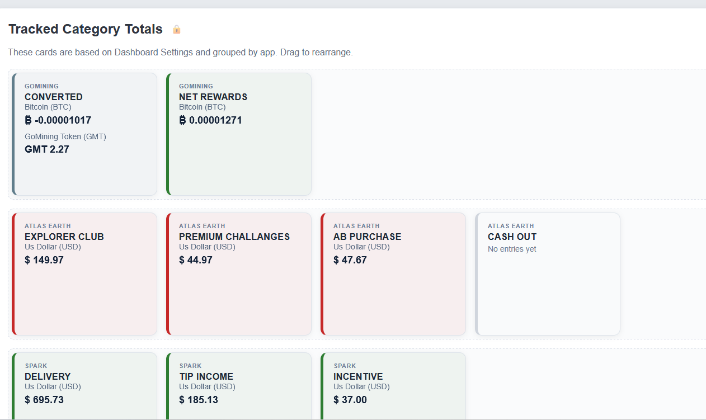
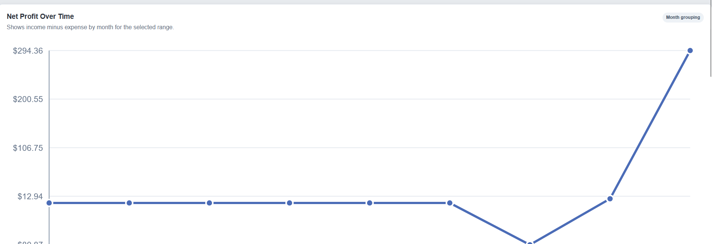
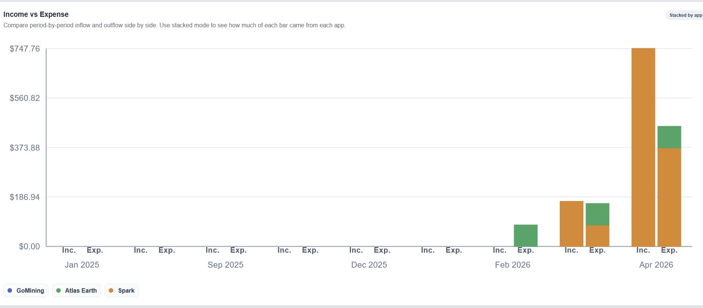
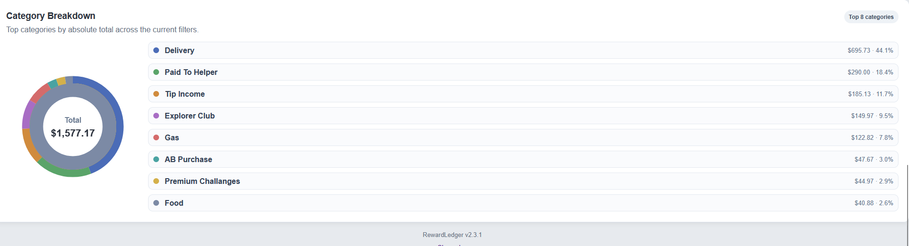
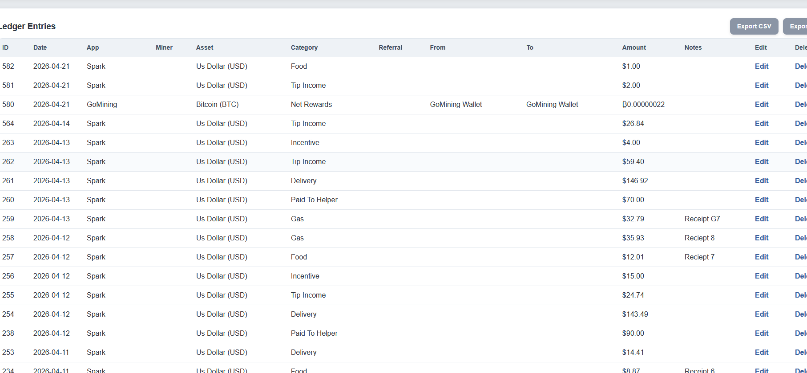
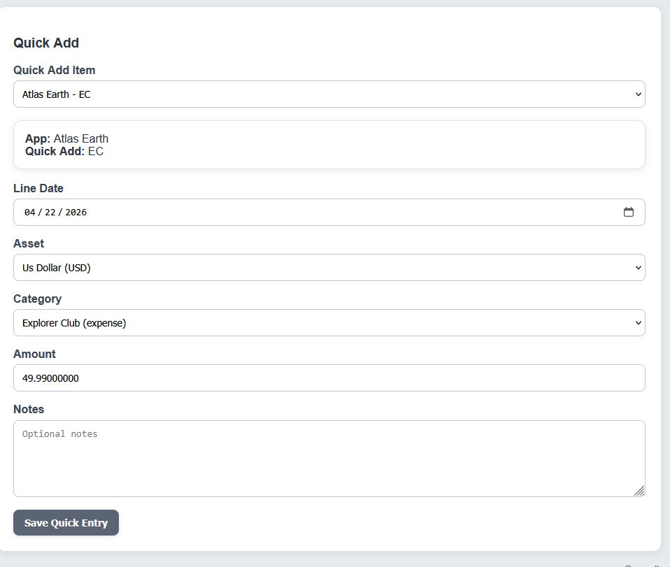
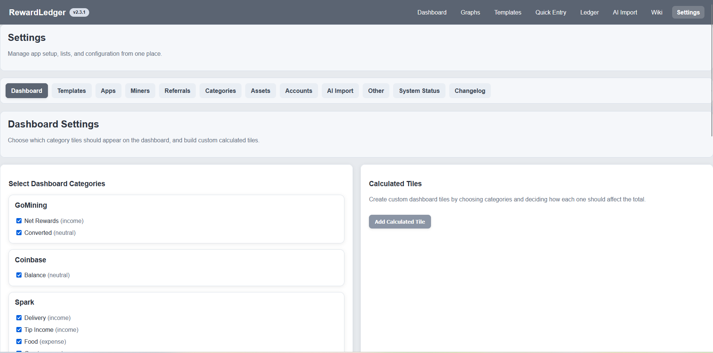
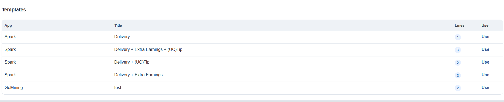

# RewardLedger

<p align="center">
  <strong>A practical reward, income, expense, and asset tracking app built with PHP and MySQL.</strong>
</p>

<p align="center">
  Track mining rewards, app earnings, wallet movements, expenses, templates, quick entries, and dashboard totals in one place.
</p>

<p align="center">
  
  
  
</p>

---

## Why RewardLedger?

RewardLedger is built for real-world tracking of:

- mining rewards
- referral rewards
- delivery income
- tips and incentive pay
- wallet movements
- expenses
- category totals
- asset balances
- recurring and repeat entry workflows

Instead of spreading everything across spreadsheets, screenshots, notes, and memory, RewardLedger gives you a structured way to track what came in, what went out, where it came from, and how it changed over time.

It is especially useful for users who want one system for mixed sources like:

- GoMining
- Spark
- Atlas Earth
- Coinbase
- custom apps, wallets, or accounts

---

## Features

### Dashboard totals
- Track category totals by app
- View asset-based totals inside each tile
- Separate income, expense, neutral, and balance-style categories
- Dashboard cards grouped by app for a clean high-level view

### Graphs and visual reporting
- Net profit over time
- Income vs expense comparisons
- Category breakdown charts
- Different grouping and stacked views for clearer analysis

### Full ledger tracking
- Store every entry with:
  - date
  - app
  - asset
  - category
  - from / to accounts
  - amount
  - notes
- Edit and delete entries directly from the ledger
- Export ledger data to CSV or PDF

### Quick Entry
- Fast entry workflow for repeated items
- Preconfigured quick add items
- Great for everyday or repetitive logging
- Designed to reduce clicks and repetitive typing

### Templates
- Build reusable entry templates
- Store multi-line templates
- Reuse common grouped transactions quickly
- Useful for repeated patterns like app payouts, grouped expenses, or mining reward sets

### Settings-driven control
- Manage:
  - apps
  - miners
  - referrals
  - categories
  - assets
  - accounts
  - AI Import aliases
  - dashboard settings
- Designed so the app can be customized without hardcoding everything

### Multi-asset support
- Supports multiple asset types like:
  - Bitcoin (BTC)
  - GoMining Token (GMT)
  - USD
  - other fiat or crypto assets
- Per-asset display support and cleaner totals

### Reward and expense flexibility
RewardLedger is not locked to one income source or one reward model.

It works for:
- mining rewards
- app-based earnings
- wallet rewards
- referral bonuses
- expenses and purchases
- transfers and conversions
- one-off adjustments

---

## Screenshots

### Dashboard


### Net Profit Over Time


### Income vs Expense


### Category Breakdown


### Ledger


### Quick Add


### Settings


### Templates


---

## Core Workflow

### 1. Configure your system
Start in **Settings** and define the pieces of your setup:
- apps
- categories
- assets
- accounts
- miners
- referrals

### 2. Add entries
Use:
- **Quick Entry** for fast single entries
- **Templates** for repeated groups of entries
- **Ledger** editing for direct entry management

### 3. Review totals
Use the **Dashboard** to see tracked category totals grouped by app.

### 4. Analyze trends
Use **Graphs** to understand:
- profit over time
- income vs expense behavior
- category concentration

### 5. Refine and repeat
As your categories, accounts, and apps evolve, RewardLedger keeps the structure flexible enough to grow with you.

---

## Installation

### Requirements
- PHP 7.4+
- MySQL or MariaDB
- Local or hosted PHP environment

Examples:
- XAMPP
- Laragon
- UniServer Zero
- Other PHP/MySQL environments

### Setup
1. Clone or download the repository
2. Place it in your web root
3. Update your database settings in `config.php`
4. Open the project in your browser
5. The app will create or update required tables on load

Example path:

```text
/www/projects/rewardledger
